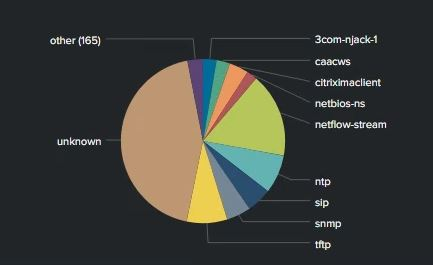

Application names used for Network port searches 

Port Applications

This csv file can be used as a lookup file for port mapping.

I have used the /etc/services file from Linux and created two fields.

transforms.conf
[ports_to_apps]
filename = all.csv

Search:-
index="network_traffic" sourcetype="network:traffic"
| fields src_ip, dest_port, dest_ip, bytes_in
| rename dest_port AS port
| lookup ports_to_apps port OUTPUT port description
| search port=*
| rename description AS application
| table src_ip, dest_ip port, application, bytes_in
| fillnull value=unknown

Install:

    Download the file, edit any port names or add new ones based on your enviroment. for further info on lookups see below link
    https://docs.splunk.com/Documentation/Splunk/8.0.6/Knowledge/Aboutlookupsandfieldactions 
